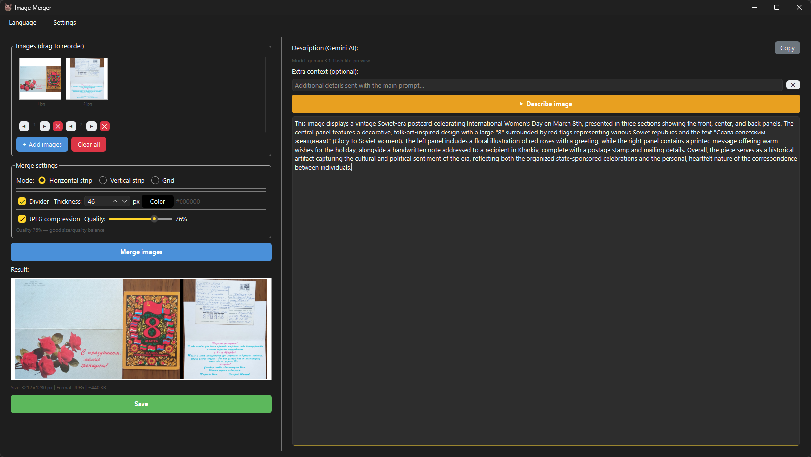

# Image Merger Gemini

A simple tool for merging images. Pick a few photos, choose how to combine them, and get one file. You can also ask Gemini AI to describe what's in the picture.

---

## Screenshot



---

## What it does

- Merges images horizontally, vertically, or in a grid
- Reorder images with ◀ ▶ buttons
- Divider between images — any color, any thickness
- Save as PNG or JPEG with quality control
- Describes the image using Gemini AI (free API key required)
- English and Russian interface
- Remembers all settings between sessions

---

## How to use

### 1. Add images
Click **+ Add images** and select your files. Supported formats: PNG, JPG, BMP, GIF, TIFF, WEBP. Up to 10 images.

### 2. Choose a merge mode
- **Horizontal strip** — images side by side left to right
- **Vertical strip** — images stacked top to bottom
- **Grid** — grid layout, set the number of columns

### 3. Optional settings
- **Divider** — check the Divider box, pick thickness and color
- **JPEG compression** — enable it and drag the quality slider if you need a smaller file
- **Grid** — set columns, padding, background color and cell fill mode

### 4. Merge
Click **Merge images** — the result appears in the preview.

### 5. Save
Click **Save** and choose where to put the file.

### 6. AI description (optional)
Go to **Settings → API key**, paste your Gemini key.  
Then click **▶ Describe image** and the app will write what it sees.  
Get a key at [aistudio.google.com/apikey](https://aistudio.google.com/apikey).

---

## Run from source

Python 3.10 or newer required.

```bash
git clone https://github.com/your-username/image-merger-gemini.git
cd image-merger-gemini

pip install PySide6 Pillow

python index.py
```

---

## Build a single EXE (Windows)

```bash
pip install pyinstaller

python -m PyInstaller --onefile --windowed --add-data "img/favicon.ico;img" --icon "img/favicon.ico" index.py
```

The finished file will be in the dist/ folder.

> **Note:** before building, make sure the FAVICON_PATH line in index.py looks like this:
> ```python
> FAVICON_PATH = os.path.join(getattr(sys, '_MEIPASS', os.path.dirname(os.path.abspath(__file__))), "img", "favicon.ico")
> ```

---

## Project structure

```
image-merger-gemini/
├── index.py
├── img/
│   └── favicon.ico
├── screenshots/
│   └── screenshot.png
└── README.md
```

---

## Dependencies

| Library | Purpose |
|---|---|
| PySide6 | GUI |
| Pillow | image processing |
| PyInstaller | build to EXE (optional) |

---

## License

MIT